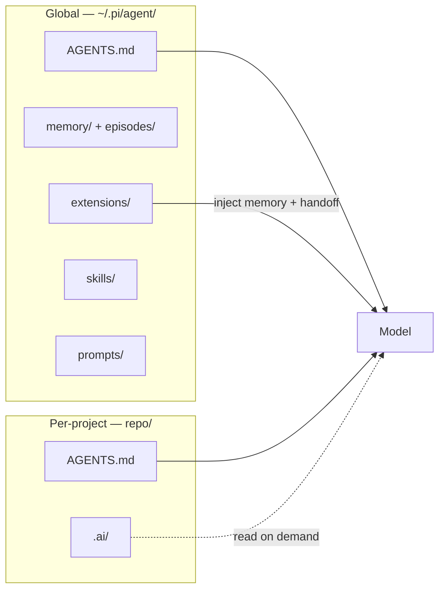

# Pi Personal Engineering Harness

Personal configuration for [Pi](https://pi.dev/) — a minimal coding agent harness. This repo makes the harness reproducible across machines.

## Structure



## Contents

- `AGENTS.md` — global instructions: identity, operating loop, safety rules, memory pointers.
- `settings.json` — default provider/model (DeepSeek `deepseek-v4-flash`, thinking `high`).
- `skills/` — capability packages: memory, engineering-memory, planning, spec-driven-development, code-review, code-review-ruleset, debugging, incident-response, handoff, herdr, episodic-memory, docker-compose-up, research-project.
- `prompts/` — quick prompt templates: /understand /plan /spec /implement /verify /review /retro /handoff /memory /memory-lint /curate /episode /docker-up.
- `extensions/` — TypeScript extensions: memory, episodic-memory, handoff.
- `doc/` — how the harness works (start with `doc/README.md`).
- `scripts/` + `cron/` — episodic-memory purge (daily).

## Documentation

See `doc/` for the internal documentation. Start with `doc/README.md` (index) and
`doc/memory-overview.md` (the memory model).

## Install on a new machine

1. Install Pi:
   ```
   npm install -g --ignore-scripts @earendil-works/pi-coding-agent
   # or: curl -fsSL https://pi.dev/install.sh | sh
   ```
2. Clone this repo into the config directory:
   ```
   git clone git@github.com:Rfontt/pi-herness.git ~/.pi/agent
   ```
   (if `~/.pi/agent` already exists, move it aside first)
3. Set the DeepSeek API key (NOT in this repo — it's a secret):
   - `export DEEPSEEK_API_KEY=...`, or
   - run `pi` → `/login` → DeepSeek, or
   - write it manually to `~/.pi/agent/auth.json` (mode 0600).

## Notes

- `auth.json`, `trust.json`, `sessions/`, `models-store.json` are intentionally NOT versioned (secret / machine-specific / cache).
- Per-project engineering memory lives in each project's `.ai/` directory (versioned in that project's own git repo).
