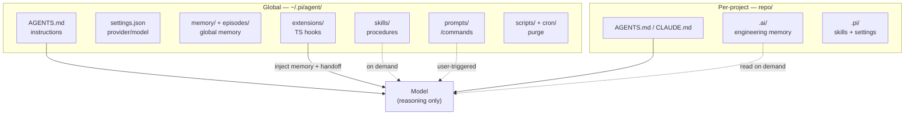

# Pi harness — documentation

Documentation for Rita's personal engineering harness ("herness"). Each file
covers one concept; this is the index.

## Harness structure



The model only reasons; the harness owns context, tools, memory, skills, and
verification. See [harness-structure.md](harness-structure.md) for the full
breakdown.

## Memory at a glance

Memory in Pi is split along two axes — **scope** (global vs per-project) and
**lifetime** (durable vs transient vs single-use):

```
                            MEMORY IN PI

  GLOBAL  (lives in ~/.pi/agent, injected into EVERY run)
  ┌────────────────────────────────────────────────────────┐
  │  memory/user-context.md   who Rita is          [durable]│
  │  memory/engineering.md    cross-project rules  [durable]│
  │  episodes/*.md            transient lessons    [TTL]    │
  └────────────────────────────────────────────────────────┘

  PER-PROJECT  (lives in .ai/ at the repo root, versioned in git)
  ┌────────────────────────────────────────────────────────┐
  │  decisions/  architecture/  incidents/  lessons/       │
  │  context/  (incl. handoff.md)                [durable]  │
  └────────────────────────────────────────────────────────┘

  SESSION CONTINUITY
  ┌────────────────────────────────────────────────────────┐
  │  .ai/context/handoff.md          where we left off     │
  │  .ai/context/compaction-recovery.md  context rescue    │
  └────────────────────────────────────────────────────────┘
```

## Quick reference

| Memory | Scope | Location | Lifetime | Written via | Injected? |
|---|---|---|---|---|---|
| User facts | global | `memory/user-context.md` | durable | `remember` (scope=user) | every run |
| Engineering rules | global | `memory/engineering.md` | durable | `remember` (scope=engineering) | every run |
| Engineering memory | per-project | `.ai/` (git) | durable | manual (`/retro`, `/handoff`) | read on demand |
| Episodes | global | `episodes/*.md` | TTL / permanent | `episode` | filtered index |
| Handoff | per-project | `.ai/context/handoff.md` | single-use | `/handoff` or auto | if `open` |

## Files

- [`harness-structure.md`](harness-structure.md) — the harness layout, the
  model/harness split, extensions, and the operating loop.
- [`memory-overview.md`](memory-overview.md) — the mental model: why memory is
  split this way, how it is injected, and which memory to use when.
- [`memory-global.md`](memory-global.md) — global memory (user facts + engineering
  rules) and the `remember` tool.
- [`memory-engineering.md`](memory-engineering.md) — per-project engineering memory
  (`.ai/`) and the FACT / DECISION / LESSON / CONTEXT taxonomy.
- [`memory-episodic.md`](memory-episodic.md) — transient cross-project episodes and
  their TTL lifecycle.
- [`memory-handoff.md`](memory-handoff.md) — session continuity: handoff + compaction
  recovery.

> Skills (`skills/*/SKILL.md`) and prompt templates (`prompts/*.md`) are the
> **procedural** memory layer — loaded on demand, not injected. They are out of
> scope here.
